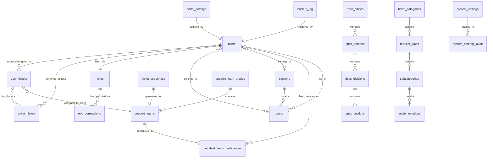
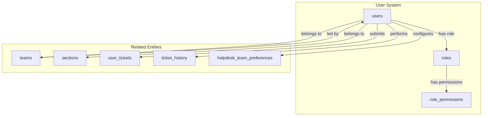
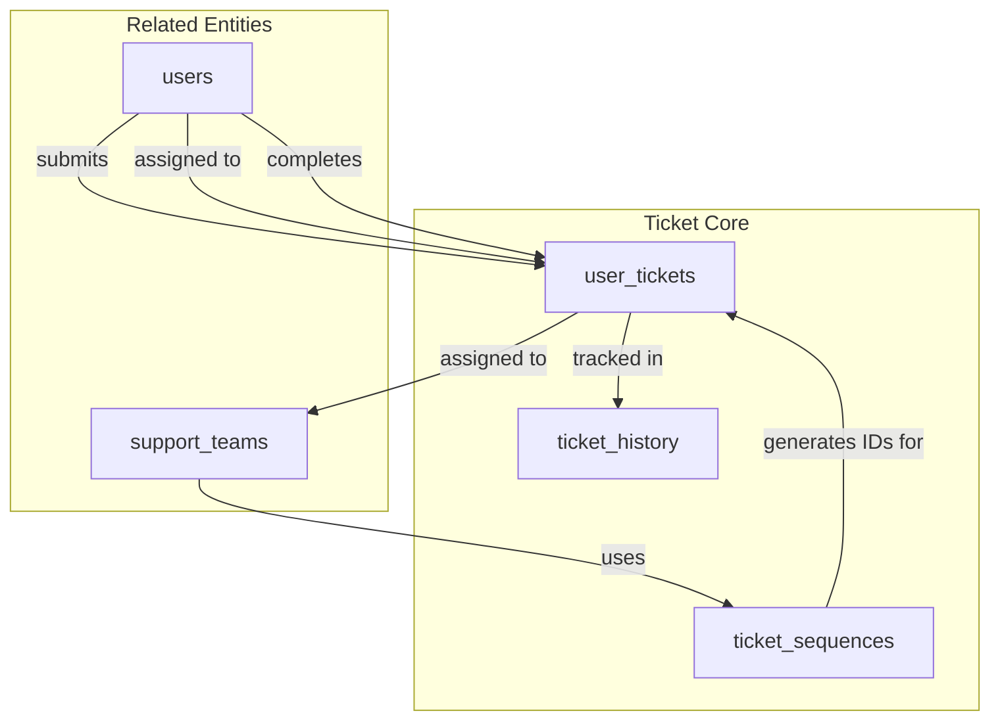
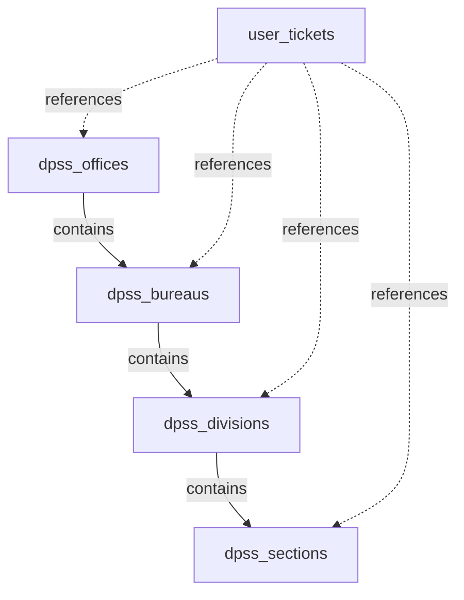
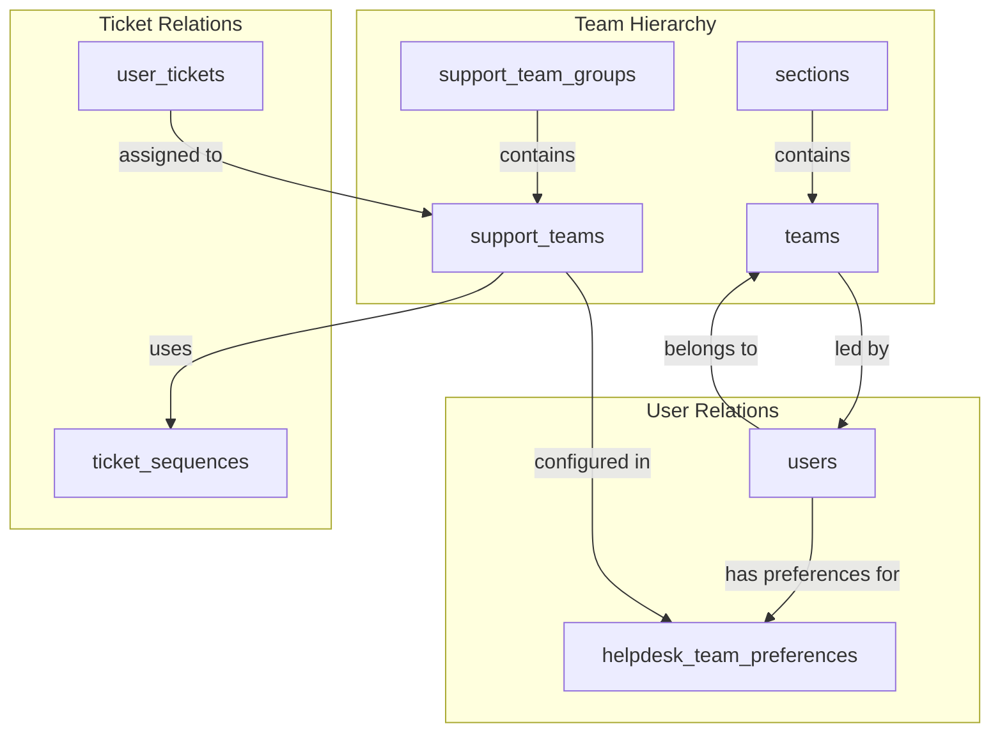
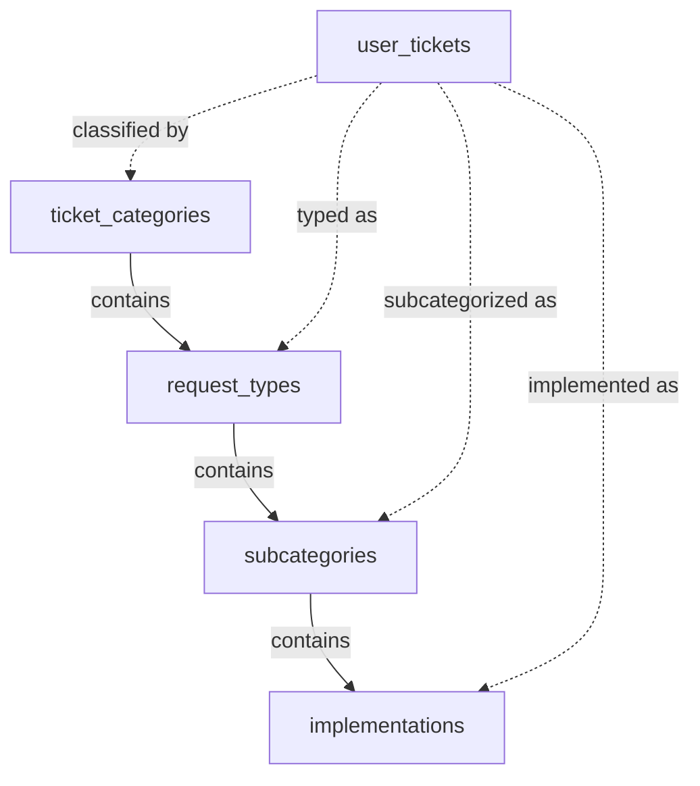
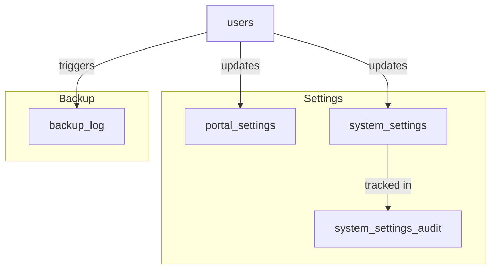

# Database Relationships Diagram

## Entity Relationship Overview



## Detailed Relationships by System

### 1. User & Authentication Relationships



### 2. Ticket System Relationships



### 3. DPSS Organization Hierarchy



### 4. Team Management Structure



### 5. Classification Hierarchy



### 6. Audit & Configuration



## Key Relationship Patterns

### One-to-Many Relationships
- `users` → `user_tickets` (user can submit many tickets)
- `roles` → `role_permissions` (role can have many permissions)
- `support_team_groups` → `support_teams` (group contains many teams)
- `ticket_categories` → `request_types` (category has many types)

### Many-to-One Relationships
- `user_tickets` → `support_teams` (many tickets to one team)
- `teams` → `sections` (many teams in one section)
- `users` → `roles` (many users have one role)

### Many-to-Many Relationships
- `users` ↔ `support_teams` (via helpdesk_team_preferences)
- `roles` ↔ permissions (via role_permissions)

### Self-Referential Relationships
- `sections` → `sections` (parent-child hierarchy)

### Audit Relationships
- All major entities → audit tables (for change tracking)
- `user_tickets` → `ticket_history` (comprehensive audit trail)
- `system_settings` → `system_settings_audit` (configuration changes)

## Data Flow Examples

### Ticket Creation Flow
```
1. User submits ticket → creates user_tickets record
2. System gets next sequence from ticket_sequences
3. Ticket assigned to support_teams
4. Action recorded in ticket_history
5. User notified based on email_recipient
```

### Permission Check Flow
```
1. User attempts action
2. System checks users.role
3. Looks up role_permissions for that role
4. Verifies permission exists
5. Allows/denies action
```

### Organization Lookup Flow
```
1. User selects dpss_offices
2. System loads related dpss_bureaus
3. User selects bureau, loads dpss_divisions
4. User selects division, loads dpss_sections
5. Selection stored in user_tickets
```

This relationship structure ensures data integrity while supporting complex workflows and maintaining a complete audit trail of all system activities.